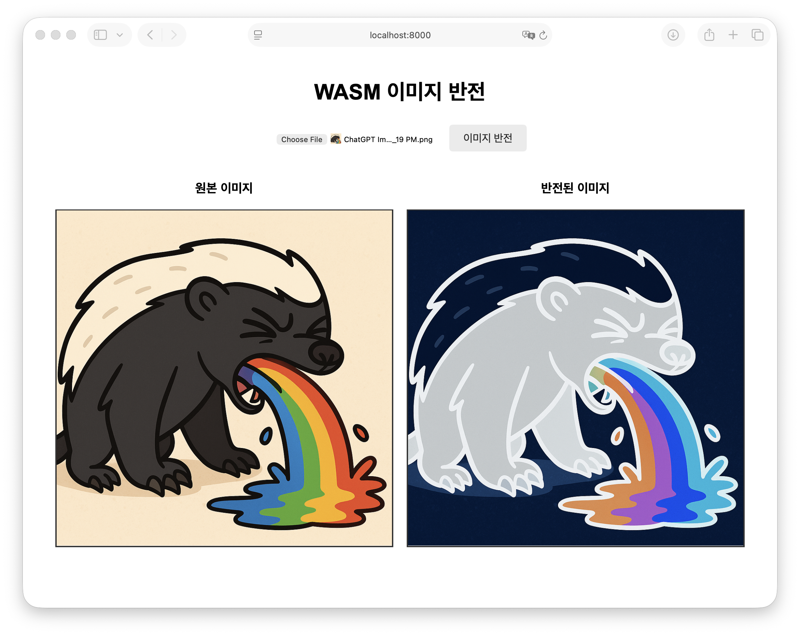

<p align="center">
    
    <br>
    
</p>

<span align="center">

# wasm-simple-demo

https://wasm-simple-demo.vercel.app

</span>


이 프로젝트는 **이미지 색상을 반전**시켜주는 웹 애플리케이션입니다. 
마치 사진의 네거티브 필름처럼 밝은 부분은 어둡게, 어두운 부분은 밝게 바꿔줍니다!

## 이미지 반전이란?

이미지의 모든 색상을 정반대로 바꾸는 것입니다.
- 검은색 → 흰색
- 빨간색 → 청록색
- 노란색 → 파란색

## 어떻게 실행하나요?

1. **컴파일하기** (C++ 코드를 웹에서 실행 가능한 형태로 변환)
   ```bash
   emcc image_inversion.cpp -o image_inversion.js \
     -s EXPORTED_FUNCTIONS='["_image_inversion", "_malloc", "_free"]' \
     -s EXPORTED_RUNTIME_METHODS='["ccall", "HEAPU8"]'
   ```

2. **웹 서버 실행하기**
   ```bash
   python3 -m http.server 8080
   ```
   또는
   ```bash
   emrun --no_browser --port 8080 .
   ```

3. **브라우저에서 접속하기**
   - 주소창에 `localhost:8000` 입력
   - 이미지 파일 선택
   - "이미지 반전" 버튼 클릭!

## 어떻게 작동하나요?

### image_inversion.cpp 파일의 역할

이 파일은 **이미지 반전의 핵심 로직**을 담고 있습니다.

#### 색상 반전 원리
디지털 이미지는 빨강(R), 초록(G), 파랑(B) 세 가지 색의 조합으로 이루어져 있습니다.
각 색상은 0~255 사이의 숫자로 표현됩니다.

- **0**: 색이 전혀 없음 (어두움)
- **255**: 색이 가득 참 (밝음)

**반전 공식**:
```
새로운 색상 = 255 - 원래 색상
```

예시:
- 원래 빨강값이 200 → 반전 후 55 (밝은 빨강 → 어두운 빨강)
- 원래 초록값이 50 → 반전 후 205 (어두운 초록 → 밝은 초록)

#### 코드 설명 (쉽게!)

```cpp
for (int i = 0; i < width * height * 4; i += 4) {
```
- 이미지의 모든 픽셀을 하나씩 확인합니다
- 한 픽셀당 4개의 숫자(빨강, 초록, 파랑, 투명도)가 있어서 `i += 4`로 4칸씩 이동합니다

```cpp
image[i] = 255 - image[i];          // RED 반전
image[i + 1] = 255 - image[i + 1];  // GREEN 반전
image[i + 2] = 255 - image[i + 2];  // BLUE 반전
```
- 빨강, 초록, 파랑 값을 각각 반전시킵니다
- 투명도(`image[i + 3]`)는 그대로 둡니다 (안 그러면 이미지가 투명해져요!)

## 파일 구조

```
wasm-simple-demo/
├── image_inversion.cpp       # C++ 코드 (이미지 반전 로직)
                              # 기말 프로젝트에서 구현해야 하는 파일!

├── index.html                # 웹 페이지
├── style.css                 # 디자인 스타일

├── image_inversion.js        # WASM으로 변환된 JavaScript (자동 생성됨)
└── image_inversion.wasm      # 실제 실행되는 바이너리 파일 (자동 생성됨)
```
